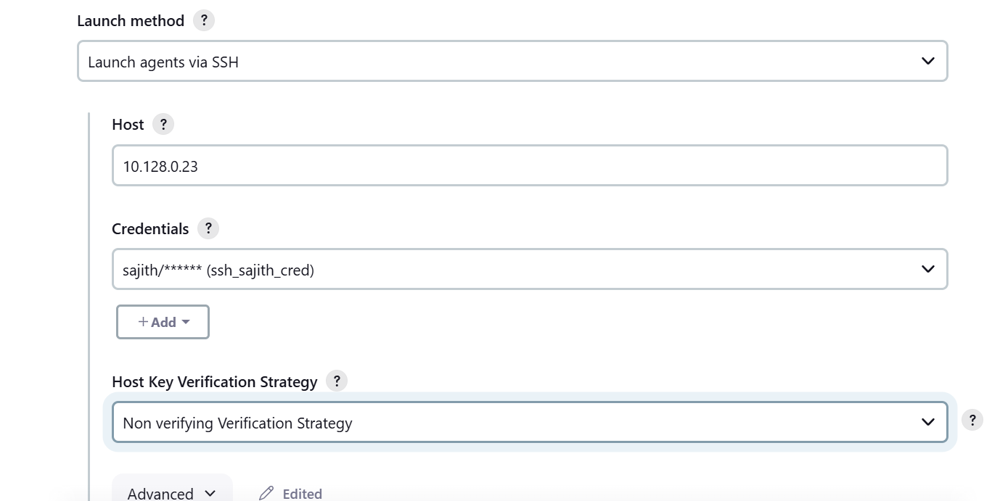

# Jenkins

* It is a open source and java based tool.
* `CI` is the process of automating the build and testing the code every time when developer pushes the latest code to version control system.
* `CI` is a software development practice where developers regularly merge the code changes into a central repo,after which the automation builds and test are been running.
* Build types
    
    * `Daily Build` : When ever developers wants have there own sort of builds they will try to deploy them at that commit id and currently we are having that process manullay only
    * `Nighty Build` : Nightly builds are one that having build cutover taken place during a particular time frame and all the commmit ids that are been incorperated into that particular time frame will be developed into build. a  place Certain time build deployed in `QA`
    * `Release Channel build` : It is nothing but the functionality that are going into the production once they are been fixed they are been cutted over to a branch is called `release branch` aand this release branch will be deployed in environment called as `stage` environment and the testing team will be deploying.
* `/var/lib/jenkins` it jenkins home directory
* create a one server
* In jnekins runing as `user` not `root`
* If you want perform any sort of operations all these oprations will be running a user called `jenkins`
* Our user called as Jnekins user should be having a respective permissions. 

* Jobs created(configured) in `Master node`
* Jobs execution doing in `Slave (worker node)`
```bash
     gcloud compute instances create jenkinsmaster  --zone=us-west4-b --machine-type=e2-medium  --create-disk=auto-delete=yes,boot=yes,device-name=sonarqube,image=projects/centos-cloud/global/images/centos-7-v20230615,mode=rw,size=20
$ sudo -i
$ yum install wget 
$ sudo wget -O /etc/yum.repos.d/jenkins.repo https://pkg.jenkins.io/redhat-stable/jenkins.repo
$ sudo rpm --import https://pkg.jenkins.io/redhat-stable/jenkins.io-2023.key
$ yum search jdk
$ yum install java-11-openjdk.i686
$ yum install jenkins
$ systemctl start jenkins
$ systemctl status jenkins
ip_address:8080
$ cat /var/lib/jenkins/secrets/intialAdminPassword
```
* If we want to perform any task that task is been considerd as a `Job`.It is a sequence of actions.
  * `Freestyle jobs` : most common type jobs.Legacy applications
     * set > file_name.txt in job `build step`
     * `/var/lib/jenkins/workspace`
     * Data will be stored in jenkins workspace.
  * `Pipeline jobs` : work flow --> DSL --> Jenkins file
     * Jenkins Pipeline (or simply "Pipeline" with a capital "P") is a suite of plugins which supports implementing and integrating continuous delivery pipelines into Jenkins.
  * Githug org jobs
  * Folder jobs 
  * `Multi-branch pipeline jobs` : In your project each and every branch can able to build on its own 
  * When we create a job and that job is been build to run the applictaion 
# Manage Jnekins
  * `System` : Any configuration setting (global)
  * `Tools` : In jenkins machine we configure tools like `Git,java,maven`
  * `Plugins` : By deafult jenkins is configured plugins.
    * Jenkins plugins are a piece of software,onecwe install them they will enhance the jenkins functionality.
    * By def
    * `Updates`
    * `Available Plugins`
    * `Installed Plugins`
    * `Advanced Plugins`
  * `Nodes`
  * `Security`: Permission of users
  * `Credentials` : Storing the passwords 
* Webserver job:
  * freestyle: Build steps: Execute shell
  ```bash
    * sudo yum install httpd -y
    * sudo systemctl start httpd
    * suod systemctl enable httpd
  ```
    * Select SCM and configure `git repo`(in this git repo we can create one index.html file <h1>comming from gitgub</h1>)
    * Build steps : Execute shell
    ```bash
    sudo cp index.html /var/www/html
    ```
  * `Build Periodically`: It builds for every minute, even though there is no change in git 
  * `Poll SCM` : Check every minute and only build when there is change 
  * `WebHook` : Two options to configure
    * `github repo`: Go repo > setings > webhooks > Add webhook > playload url: jenkins_url/github-webhook > content type: applictaion/json >add webhook
    * `jenkins level`: go to job > configure >Build triggers: Github hook trigger 
---
# java spring application
  * https://github.com/spring-projects/spring-petclinic.git
  * create a new free style job in jenkins
    * Configure > scm:[git clone https://github.com/spring-projects/spring-petclinic.git] > buid steps: Execute shell[mvn package]
  ```bash
  export JAVA_HOME=/opt/jdk-17
  export PATH=$PATH:$JAVA_HOME/bin
  export PATH=$PATH:/opt/apache-maven-3.8.8/bin
  export M2_HOME=/opt/apache-maven-3.8.8
  mvn package -DskipTests
  ```
# Scenario
* Lets create a freestyle job to build spring petclininc application and this is based on java
  *  When developer commits the code,automatically a build should trigger.
  * By default when the developers build the package,all the unit test cases will be executed and will be stored in `target/surefire-reports` as `.xml` file.
    * NOw the devs need to verify the report.
  * I need provide them an option tp verify the reports without login to jenkinsmaster/slave
```bash
# Go to post-build actions : Publish Junit test results report
  * test report XMLS : target/surefire-reports/*.xml
```
* Before Post-build action
 
* After Poste-build actions

  * Downloading the artifacts in local
```bash
# post-build actions: Archive the Artifcats
  * Files to archive: target/*.jar
```


* If `slave is not ready` issues occured then we need to restart the `jenkins`
  * Two ways of restart
    * `restart` : url/restart what are jobs are pending state that jobs are discard. It means forcefull restart.
    * `safe restart` : It means all jobs (pending,running) are excuted after that restart.
      * url/safeRestart --> every time is not recommended
      * manage jenkins > plugins 

# spring pet clinic
* Create four servers
  * Build
  * Sonar
    * pom.xml 
      * edit pom.xml and configure token
```bash
  <sonar.host.url>http://34.42.38.27:9000/</sonar.host.url>
  <sonar.login>sqa_2ae56d82cfdbb7d51e4048d5a4aeb233457e4ce0</sonar.login>
```
    * mvn sonar:sonar -D
    * sonar.properties
  * Nexus
    * maven configuration in `conf/setting.xml` and servers
    * Add the tag in `pom.xml` under `distrubtion management`
```bash
* Login to nexus 
  * settings > repositories > create repository: maven2hosted > name: first-release > version policy: Release >deployment policy: allow redeploy 
  * and copy the repo url:http://34.41.70.162:8081/repository/first-release/ and configure this url in pom.xml
  * and create another repository >settings > repositories > create repository: maven2hosted > name: first-release > version policy: sanshot >deployment policy: allow redeploy
  * copy the url of repo http://34.41.70.162:8081/repository/first-snapshot/
pom.xml
  <distributionManagement>
      <repository>
          <id>nexus</id>  
          <name>Release Repos</name>
          <url>http://34.41.70.162:8081/repository/first-release/</url>
       </repository>
      <snapshotRepository>
          <id>nexus</id>
          <name>Snapshot Repos</name>
          <url>http://34.41.70.162:8081/repository/first-snapshot/</url>
      </snapshotRepository>
  </distributionManagement>
```
  * Tomcat
```bash
* Create a one free style job
  * Configure SCM 
  * Go to sonar > security > token name: jenkins_token; type: Global;Expiresin : 30 > sqa_2ae56d82cfdbb7d51e4048d5a4aeb233457e4ce0
  * Copy that token and configure that token in pom.xml file i edit above like that.
  * configure > build steps maven version:mymaven; Golas: clean package sonar:sonar > build successfull 
    * And check the sonarqube the project is deployed 
  * Upload the jar file into the nexus
    *    configure > build steps maven version:mymaven; Golas: clean deploy sonar:sonar > build faild beacuse we are not configure `settings.xml` file thats why build is faild
  * 
[error]
[INFO] ------------------------------------------------------------------------
[ERROR] Failed to execute goal org.apache.maven.plugins:maven-deploy-plugin:2.8.2:deploy (default-deploy) on project my-maven-app: Failed to retrieve remote metadata com.sivaacademy.app:my-maven-app:1.0-SNAPSHOT/maven-metadata.xml: Could not transfer metadata com.sivaacademy.app:my-maven-app:1.0-SNAPSHOT/maven-metadata.xml from/to nexus (http://34.41.70.162:8081/repository/first-snapshot/): authentication failed for http://34.41.70.162:8081/repository/first-snapshot/com/sivaacademy/app/my-maven-app/1.0-SNAPSHOT/maven-metadata.xml, status: 401 Unauthorized -> [Help 1]
[ERROR] 
[ERROR] To see the full stack trace of the errors, re-run Maven with the -e switch.
[ERROR] Re-run Maven using the -X switch to enable full debug logging.
[ERROR] 
[ERROR] For more information about the errors and possible solutions, please read the following articles:
[ERROR] [Help 1] http://cwiki.apache.org/confluence/display/MAVEN/MojoExecutionException 

# vi vi /opt/apache-maven-3.8.8/conf/settings.xml 
</server>
    -->
    <server>
      <id>nexus</id>
      <username>admin</username>
      <password>admin@123</password>
    </server>
  </servers>
  * Re run the job and build successfull
```
# Credentials
* Github: user name and password (Personal Access Token )
  * github > account > setting > DevSeloper settings > Personal Access Token > token > generate new token 
* Linux : SSH key
* GCP : Json file
* Sonar : Token
* Jenkins > manage jenkins > credentials > Global > Add credentials
  * kind: user_name with password > scope: Global > user_name: abxxx@gmail.com(mail) > Password : Personal Access Token > ID: saji_github_cred > description: saji_github_cred
---
* Install one plugin called `Deploy to container` 
  * In Post-build Action one option is available`Deploy war/ear to a container` 
    * 


`Build Name and Description Setter`
* `Execute concurrent builds if necessary`: It means one can run multiple times
# Jenkins Master Slave Configuration:

* The jenkins master acts to schedule the jobs,assign slaves and send builds to slaves to execute the jobs.
* It also monitor the slave state(offline or online) and get back the build result responses from slaves and the display build result on the console output.
* Jenkins agent can be lanuched in physical machines,virtual machines,kubernetes clusters and with Docker images.
* Slaves they can be VMs or they can be Containers.
  * Under the VM they can be Linux machines and Windows machines as well.
* GCP : Cloud Build
  * Build,Test and Deploy on our serverless CI/CD platform.
* Create one machine `slave-1`
  * Connect to slave-1 and install required packages
* Connected
* Agent Program
* Registor 
```bash
# install java
$ yum install java-11-openjdk.x86_64 -y
$ cd /opt
$ sudo yum -y install wget curl
$ wget https://download.java.net/java/GA/jdk17.0.2/dfd4a8d0985749f896bed50d7138ee7f/8/GPL/openjdk-17.0.2_linux-x64_bin.tar.gz
$ tar xvf openjdk-17.0.2_linux-x64_bin.tar.gz
$ sudo mv jdk-17.0.2/ /opt/jdk-17/

# Install maven
$ wget https://dlcdn.apache.org/maven/maven-3/3.8.8/binaries/apache-maven-3.8.8-bin.tar.gz
$ tar -xzvf apache-maven-3.8.8-bin.tar.gz

$ vi /etc/profile
export JAVA_HOME=/opt/jdk-17
export PATH=$PATH:$JAVA_HOME/bin
export PATH=$PATH:/opt/apache-maven-3.8.8/bin
export M2_HOME=/opt/apache-maven-3.8.8
$ source /etc/profile
$ mvn --version

## 
$ adduser sajith
$ passwd sajith
1234
$ vi /etc/ssh/sshd_config
PasswordAuthentication yes
$ systemctl restart sshd.service
# open power shell ssh sajith@ip_address
$ mkdir jenkins
$ cd jenkins 
$ pwd
/home/sajith/jenkins

```
  * Go to jenkins master
    * Nodes > New Node >Node name: javanode;type: permanent agent > create.
      * number of executors : 2 > Remote root directory : /home/sajith/jenkins > Labels: mvn-slave > Usage : Only Build jobs with label expression matching this node > Launch method : Launch agent via SSH;Host: slave-1_ip;Credentials: create (username:sajith,passwd:1234)> save


* Connection is closed 

* Change the `Host key verification strategy`

  * Save and Relaunch agent


* Create a one job and select one option that is `Restrict where this project can be run`

# Pipelines

* Jenkins Pipeline (or simply "Pipeline" with a capital "P") is a suite of plugins which supports implementing and integrating continuous delivery pipelines into Jenkins.
* Pipeline provides an extensible set of tools for modeling simple-to-complex delivery pipelines "as code" via the Pipeline domain-specific language (DSL) syntax. 
* Two ways of pipeline
  * `Declerative` (DSL): New method 
     * Groovy : I will be using something called Declerative pipelines but if there is a requirement for me to modify something as a coding formate then i might be using something called as `Scripted` as well.
  * `Scripted` : Old way of writting pipelines (Groovy)
```bash
# starting with node then it is called as scripted pipeline
node {

}

# If it is starting with pipeline then it is called as Declerative
pipeline {

}

##
pipeline{
    agent any
    stages {
        stage (`Build`) {
            steps{
                echo "Hello!,sajith"
            }
        }
    }
}
```
* Top level statges in pipeline

* agent
  * any
  * none
  * label
  * node
  * dockerfile
  * docker
* stages
  * stage
    * steps
      * script
        * custom code in groovy
      * sleep
      * error
      * retry
      * timeout
    * angent
    * tools
    * options
    * environment
    * conditionas (when)
    * parallel
    * input
      * message
      * ok
      * submitter
      * submitParameter
      * parameters
    * post
* environment
  * credentials
* Options
  * timeout
  * retry
  * timestamps
  * buildDiscard
---
```bash
//any: we will execute the pipeline or stage with any avialable agnet
// label: Idealy this is a string which informs our jenkins to run on a particular slave
// none : When we apply none, no global agent will be picked. The individual stage should specify respective agnet , based on theire reuirements.
pipeline {
    agent any
    stages {
        stage ('First stage') {
            //name: can be userfriendly name,but needs to be specific for the task performing
            steps {
                echo "welocm to first pipeline"
            }

        }
    }
}
// 
### second
pipeline {
    agent {
        label 'mvn-slave'
    }
    stages {
        stage ('HostName') {
            steps {
                sh 'hostname -i'

            }
        }
    }
}
## 
pipeline {
    // the below agent is at the pipeline level and applies for all stages
    agent none
    stages {
        stage ('build') {
            //the below agent is for specific stage, 
            agent {
                node {
                    label 'mvn-slave'
                    customWorkspace "/home/sajith/customsajith"
                }
               
            }
            steps {
                echo "print long list"
                sh 'hostname -i'
                sh 'cat import.txt'
            }
        }
    }
}
```
* `Node` : agent { node { label 'labelName' } } behaves the same as agent { label 'labelName' }, but node allows for additional options (such as customWorkspace)

* Multi-Branch : The Multibranch Pipeline project type enables you to implement different Jenkinsfiles for different branches of the same project. In a Multibranch Pipeline project, Jenkins automatically discovers, manages and executes Pipelines for branches which contain a Jenkinsfile in source control.
  * Create one new repo(private)


* In git hub we create multiple branchs (branch1,branch2,hotfix,release)
* now we can create `multi-branch` pipeline


* Save the pipeline after that it will be scaning the repo


* Out of six branches `five` branches having `Jenkinsfile`

* It means every 1 min scanning is build


* Scainig the tags also


```bash
pipeline {
    agent any
    environment {
        // credentials (id), this id should be the same from jenkins credentials
        Git_hub_cred = credentials ('Git_Hub')
    }
    stages {
        stage ('git-clone') {
            steps {
                echo "git hub credentials are ${Git_hub_cred}"
                echo "user id is ${Git_hub_cred_USR}"
                echo "password is ${Git_hub_cred_PSW}"
            }
        }
    }
}
```


* If we want save some time and if we want to execute the steps parallely then we can write something called "Parallel"
* I have created a pipeline way that only a particular group of pepoles can allow the pipeline allow to the production using `input`


* Authentication : who is trying to authenticate
* Authorization: scope
# Creating Users
* Manage jenkins > Users > Create user 

* Restrict that user
  * manage jenkins > security > Security Realm : Jenkins own user database > Authorization : Matrix-based security > Add user

```bash
// lets write a bit complex one with both input and parameters.
// stage level > input and parameters
pipeline{
    agent any
    stages {
        stage('Deploying to dev'){
            steps {
                echo "deploying to dev env "

            }
        }
        stage('Deploy to prod'){
            options{
                timeout(time: 60, unit: 'SECONDS')
            }
            input{
                message "should be continue ?"
                ok "Approved"
                submitter "sajith"
                submitterParameter "whoApproved"
                parameters {
                    string(name: 'CHANGE_TICKET', defaultValue: 'CH12345', description: 'please enter change ticket number')
                    booleanParam(name: 'SRE Approved ??', defaultValue: true, description: 'Is approval taken from SRE')
                    choice(name: 'Release', choices: 'Regular\nhotfix', description: 'what type release is this?' )
                    text(name: 'Notes', defaultValue: 'enter release notes if any..', description: 'release notes')
                    password(name: 'myPASSWORD', defaultValue: 'SECRET', description: 'A secret password')
                    credentials(name: 'myCredentials', description: 'my credentials stored', required: true)
                }
            }
            steps{
                echo "the change ticket is ${CHANGE_TICKET}"
                echo " Deploying to production"
                echo "this is a ${Release} Release"
                echo "Approved by ${whoApproved}"
            }
        }
    }
}

// pipeline level >> params.NAME
// stage level and Inuput level >> parameters > NAME
```


* Email Configuration in Jenkins
  * Mailer Plugin
  * Extended email notification 
  * Manage jenkins > system > E-mail Notification:[SMTP server: smtp.gmail.com], Advanced:[username:sajithXXXX@gmail.com,Password:past the token,SMTP port: 465 and select Use SSL, Reply-To-Address:sajithXXXX@gmail.com]
  * Go to gmail > managed account > security > 2-step authentication > get started > app password[name: jenkins, copy the token]

* `pipeline-utility-steps` this plugin is used for the read the pom.xml file
* `Nexus Artifact Uploader` this pluign is used for uploading the artifcats into nexus repo.


# shared Libraries
* Pipeline flow

* As Pipeline is adopted for more and more projects in an organization, common patterns are likely to emerge. Oftentimes it is useful to share parts of Pipelines between various projects to reduce redundancies and keep code `DRY`.
* Pipeline has support for creating `Shared Libraries` which can be defined in external source control repositories and loaded into existing Pipelines.
* A Shared Library is defined with a name, a source code retrieval method such as by SCM, and optionally a default version. The name should be a short identifier as it will be used in scripts.

* `src` : The src directory should look like standard Java source directory structure. This directory is added to the classpath when executing Pipelines.
* `vars` : The vars directory hosts script files that are exposed as a variable in Pipelines. The name of the file is the name of the variable in the Pipeline. So if you had a file called `vars/log.groovy` with a function like `def info(message)…​` in it, you can access this function like `log.info "hello world"` in the Pipeline. You can put as many functions as you like inside this file. Read on below for more examples and options.

* Create one Github repo
  * src
    * com
      * i27academy
        * builds
          * file_name.groovy
  * vars
    * 
* configure share library in jenkins
  * jenkins > manage jenkins > system > Global Pipeline Libraries


